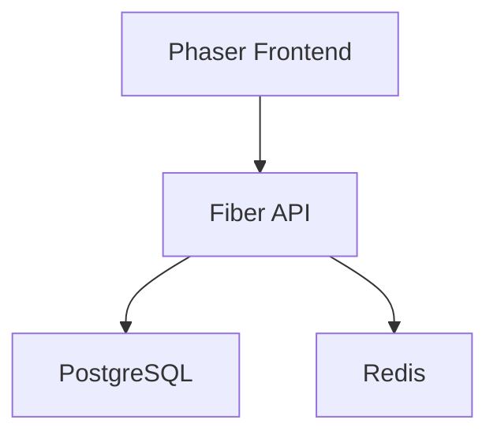
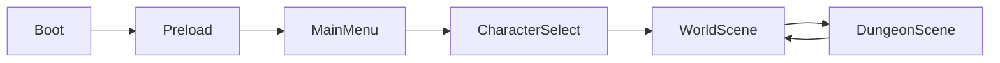
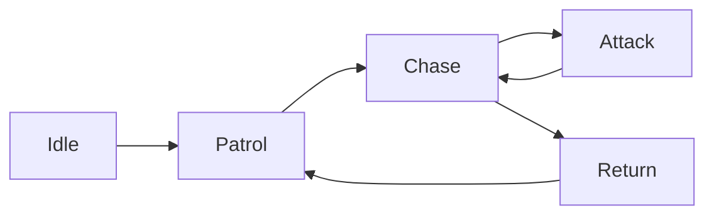
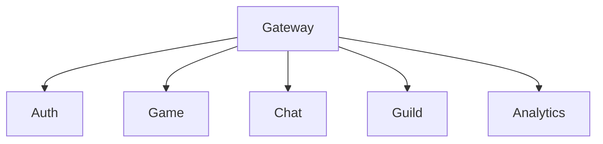

# Kingdoms of Ruin

# Architecture Document

Version: 1.0

---

# High Level Architecture



Frontend menangani:

- Rendering
- Input
- UI
- Scene Management

Backend menangani:

- Authentication
- Save Game
- Inventory Persistence
- Quest Persistence
- Multiplayer Synchronization

---

# Frontend Architecture

Frontend menggunakan:

- Phaser.js
- TypeScript
- Zustand

Folder Structure:

```text
src/

core/
game/
scenes/
systems/
entities/
components/
ui/
store/
services/
utils/
```

---

# Scene Architecture



---

# Entity Component Architecture

Setiap object menggunakan ECS-lite pattern.

Entity:

- Player
- Enemy
- NPC
- Companion
- Projectile
- Resource

Component:

- Position
- Health
- Inventory
- Equipment
- CombatStats
- AI
- Animation

---

# Combat Architecture

```mermaid
graph TD

Input
↓
Combat System
↓
Damage Calculator
↓
Target Health
↓
Death Handler
↓
Loot Drop
```

Combat Flow:

1. Player menyerang
2. Hit detection
3. Damage calculation
4. Critical calculation
5. Defense reduction
6. Health update
7. Death check
8. Loot generation

---

# Inventory Architecture

```mermaid
graph TD

Item
↓
Inventory
↓
Equipment
↓
Stat Recalculation
```

Inventory Rules:

- Stackable items
- Non-stackable items
- Equipment items
- Quest items

---

# Equipment Architecture

Slots:

- Helmet
- Chest
- Gloves
- Boots
- Weapon
- Shield
- Ring 1
- Ring 2
- Necklace

Stat Pipeline:

```text
Base Stats
+
Equipment Stats
+
Buff Stats
=
Final Stats
```

---

# Dungeon Generation Architecture

```mermaid
graph TD

Seed
↓
BSP Generator
↓
Room Placement
↓
Corridor Generator
↓
Enemy Placement
↓
Loot Placement
↓
Dungeon Ready
```

Dungeon harus deterministic menggunakan seed.

---

# AI Architecture

Enemy States:

- Idle
- Patrol
- Chase
- Attack
- Return
- Dead



---

# Companion Architecture

Companion memiliki:

- Inventory sendiri
- Equipment sendiri
- Skill sendiri

Behavior:

- Follow
- Attack
- Heal
- Gather

---

# Quest Architecture

Quest States:

- Available
- Accepted
- Completed
- Failed

Quest Types:

- Kill
- Collect
- Explore
- Escort

---

# Settlement Architecture

Buildings:

- Town Hall
- Farm
- Blacksmith
- Warehouse
- Barracks

Resources:

- Wood
- Stone
- Iron
- Food

Settlement Loop:

```mermaid
graph TD

Gather
↓
Store
↓
Craft
↓
Build
↓
Upgrade
↓
Gather
```

---

# Save Game Architecture

Backend menyimpan:

- Character
- Inventory
- Equipment
- Quests
- Settlement
- World State

```mermaid
graph TD

Client
↓
Save API
↓
Fiber
↓
PostgreSQL
```

---

# Multiplayer Architecture

```mermaid
graph TD

Player A
Player B
Player C

A --> WS
B --> WS
C --> WS

WS --> Redis

Redis --> Game Server
```

Multiplayer hanya aktif pada fase akhir development.

---

# Security Architecture

Authentication:

- JWT Access Token
- Refresh Token

Validation:

- Server authoritative
- No client-side trust

Protected Data:

- Gold
- Inventory
- Character Stats
- Quest Progress

---

# Future Scaling

Future Services:

- Matchmaking Service
- Chat Service
- Guild Service
- Analytics Service



---

# Architecture Principles

1. Modular
2. Maintainable
3. Testable
4. Scalable
5. Server Authoritative
6. Feature Isolated
7. AI-Agent Friendly