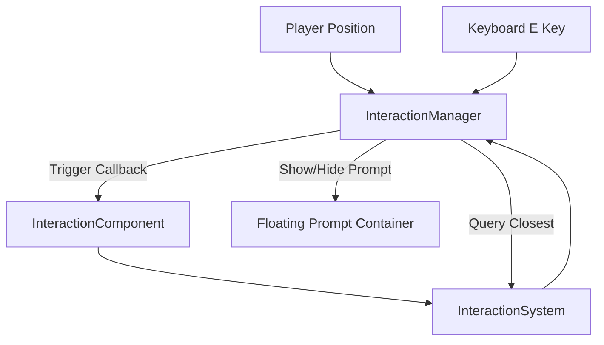

# Kingdoms of Ruin - Core Systems Documentation

This document explains the technical design and data flow of core systems implemented in Phase 1: Core Interaction Loop.

---

## 1. Interaction System
The Interaction System decouples UI presentation, input listeners, and distance calculation from the Phaser scenes.

### Key Components:
- **`InteractionComponent`**: A data holder attached to any game entity (like a landmark or character) containing its interaction radius, offset position relative to the entity center, prompt string, callback method, and enabled status.
- **`InteractionSystem`**: A lightweight registry storing active `InteractionComponent`s. It exposes query helpers to find the closest interactable entity to any coordinate.
- **`InteractionManager`**: Attached to `WorldScene.ts`. It polls the closest interactable to the player's position, manages the visibility and position of the floating prompt bubble `[E] Action`, and listens to the keyboard `E` key to fire callbacks.

---

## 2. Landmark System
To prevent scenes from turning into giant god-objects, landmarks are implemented as standalone classes.

- **Campfire (`Campfire.ts`)**: Custom container displaying logs, a pulsing orange light glow graphics object, and red-orange/yellow/white overlapping circle flames with erratic size/position flickering tweens. Prompt: `[E] Rest`. Callback: Emits rest event.
- **Ancient Shrine (`AncientShrine.ts`)**: Static container representing the central ruined shrine. Configures its own static body collision bounds. Prompt: `[E] Examine`. Callback: Emits examine event.
- **Treasure Chest (`TreasureChest.ts`)**: Container representing a closed chest. Once opened, switches texture to `chest-open`, runs a scale bounce tween, triggers a backend database add-item action, and unregisters its interaction component to prevent double-looting.

---

## 3. Item & Inventory System
A fully data-driven system built to handle hundreds of future items and multiple storage categories.

### Schema (`inventory_items`):
Supports player, companion, chest, or settlement ownership dynamically:
- `owner_type` (VARCHAR): e.g. `'player'`, `'chest'`, `'settlement'`
- `owner_id` (VARCHAR): e.g. `'player_default'`
- `item_id` (VARCHAR): e.g. `'wood'`
- `quantity` (INT)

### Frontend Structure:
- **`ItemDefinition`**: Interface detailing static properties of items:
  - `id`: Unique identifier (e.g., `'wood'`).
  - `name`: Human-readable name.
  - `description`: Lore/behavior text.
  - `category`: Category enum (`'resource' | 'weapon' | 'armor' | 'consumable' | 'quest'`).
  - `icon`: Texture key used to draw the slot icon.
- **`ItemRegistry`**: Map registration holding definitions.
- **`InventoryStore` (Zustand)**: Orchestrates REST API fetches and upserts with the Go Fiber backend. Automatically syncs local client state.
- **`InventoryUI`**: Toggled via `TAB`. Draws a 24-slot grid, categorizes items using filter tabs, and displays descriptive tooltips on hover.

---

## 4. Toast System (`ToastManager.ts`)
A sliding notification popup overlay. Whenever a new toast is created, it moves all existing active toasts upwards to prevent overlap and slides/fades in the new message before fading it out after a set delay.
