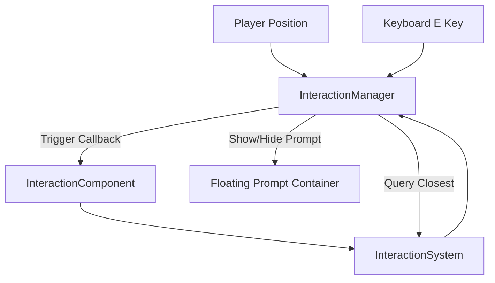

# Kingdoms of Ruin - Core Systems Documentation

This document explains the technical design and data flow of core systems implemented in Phase 1: Core Interaction Loop.

---

## 1. Interaction System
The Interaction System decouples UI presentation, input listeners, and distance calculation from the Phaser scenes.

### Key Components:
- **`InteractionComponent`**: A data holder attached to any game entity (like a landmark or character) containing its interaction radius, offset position relative to the entity center, prompt string, callback method, and enabled status.
- **`InteractionSystem`**: A lightweight registry storing active `InteractionComponent`s. It exposes query helpers to find the closest interactable entity to any coordinate.
- **`InteractionManager`**: Attached to `WorldScene.ts`. It polls the closest interactable to the player's position, manages the visibility and position of the floating prompt bubble `[E] Action`, and listens to the keyboard `E` key to fire callbacks.

---

## 2. Landmark System
To prevent scenes from turning into giant god-objects, landmarks are implemented as standalone classes.

- **Campfire (`Campfire.ts`)**: Custom container displaying logs, a pulsing orange light glow graphics object, and red-orange/yellow/white overlapping circle flames with erratic size/position flickering tweens. Prompt: `[E] Rest`. Callback: Emits rest event.
- **Ancient Shrine (`AncientShrine.ts`)**: Static container representing the central ruined shrine. Configures its own static body collision bounds. Prompt: `[E] Examine`. Callback: Emits examine event.
- **Treasure Chest (`TreasureChest.ts`)**: Container representing a closed chest. Once opened, switches texture to `chest-open`, runs a scale bounce tween, triggers a backend database add-item action, and unregisters its interaction component to prevent double-looting.

---

## 3. Item & Inventory System
A fully data-driven system built to handle hundreds of future items and multiple storage categories.

### Schema (`inventory_items`):
Supports player, companion, chest, or settlement ownership dynamically:
- `owner_type` (VARCHAR): e.g. `'player'`, `'chest'`, `'settlement'`
- `owner_id` (VARCHAR): e.g. `'player_default'`
- `item_id` (VARCHAR): e.g. `'wood'`
- `quantity` (INT)

### Frontend Structure:
- **`ItemDefinition`**: Interface detailing static properties of items:
  - `id`: Unique identifier (e.g., `'wood'`).
  - `name`: Human-readable name.
  - `description`: Lore/behavior text.
  - `category`: Category enum (`'resource' | 'weapon' | 'armor' | 'consumable' | 'quest'`).
  - `icon`: Texture key used to draw the slot icon.
- **`ItemRegistry`**: Map registration holding definitions.
- **`InventoryStore` (Zustand)**: Orchestrates REST API fetches and upserts with the Go Fiber backend. Automatically syncs local client state.
- **`InventoryUI`**: Toggled via `TAB`. Draws a 24-slot grid, categorizes items using filter tabs, and displays descriptive tooltips on hover.

---

## 4. Toast System (`ToastManager.ts`)
A sliding notification popup overlay. Whenever a new toast is created, it moves all existing active toasts upwards to prevent overlap and slides/fades in the new message before fading it out after a set delay.

---

## 5. Equipment & Character Progression System
Introduces character profile stats, slot mappings, and dynamic stat calculations synced between the PostgreSQL database and client UI.

### Database Tables:
- **`characters`**: The foundation progression table holding `id`, `name`, `level`, `experience`, and timestamps.
- **`character_equipment`**: Maps active gear to slots with columns: `owner_type`, `owner_id`, `slot_id`, and `item_id`. It enforces a unique constraint on `(owner_type, owner_id, slot_id)` so each slot holds at most one item.

### Backend Character Bootstrap Service:
- Executes on server startup.
- Uses a transaction to detect if the default character (`player_default`) exists. If missing, it creates the character and seeds starter equipment (`rusty_sword`, `traveler_hood`, `worn_leather_armor`, `old_boots`) directly into their inventory. This keeps the `GetInventory` API endpoint as a pure read operation.

### Backend Slot Validation & Transaction Safety:
- Equipment slot requests validate the `slot_id` against a strict `SlotIDRegistry` enum (`weapon`, `helmet`, `chest`, `gloves`, `boots`, `ring`) to avoid hardcoded string mismatches.
- Equipping/unequipping items run inside database transactions to ensure atomic operations (reducing item quantity or deleting from inventory, returning any previously equipped item to the inventory, and updating the slot mapping).

### Frontend Store & Derived Stats:
- **`useCharacterStore` (Zustand)**: Calculates total stats (Base + Item bonuses) and evaluates derived ratings dynamically:
  - **Max Health**: `100 + (Health * 10) + (Strength * 5)`
  - **Max Stamina**: `100 + (Stamina * 5) + (Agility * 2)`
  - **Attack Power**: `10 + (Strength * 2) + Weapon Attack Power`
  - **Armor Rating**: `(Defense * 3) + Gear Armor Rating`
  - **Move Speed**: `250 + (Agility * 1.5)`

### UI Interfaces & Responsive Layout:
- **`CharacterPanelUI`**: Opened via key `C`. Displays a paper doll equipment grid and base/derived character stats. Hovering over a slot shows equipped gear stats and exposes an interactive "UNEQUIP" zone.
- **`InventoryUI`**: Renders rarity color borders around slots (Common, Uncommon, etc.). Selecting an equipable item reveals its stats and shows an "EQUIP" button in the detail card.
- **Dynamic Positioning (`adjustLayout`)**: When both panels are opened, the UI shifts them side-by-side (Character Sheet left, Inventory right) to prevent overlap. Closing either panel centers the remaining open panel.

---

## 6. UI & Rendering Architecture
The frontend decouples heavy UI management and sprite decoration from the active game scenes.

### Component Isolation:
- **`HUDManager.ts`**: Handles creation, layout updates, resize events, and interactions of HUD elements (player profile, action buttons, instructions, dev overlays) in one localized class.
- **`PaperDoll.ts`**: Encapsulates active equipment sprite instantiation, Zustand store subscription tracking, horizontal flipping, scale inheritance, and depth ordering.

### Post-Update Render Synchronization:
- To eliminate the movement latency or frame lag where overlay equipment trails behind the player sprite, the player's shadow position and all active `PaperDoll` graphics are updated inside Phaser's `'postupdate'` event loop.
- By hook-binding to `postupdate`, all positioning adjustments occur immediately after the Arcade Physics simulation resolves player velocity and coordinates, but before the WebGL/Canvas renderer draws the active frame. This guarantees pixel-perfect movement alignment.

