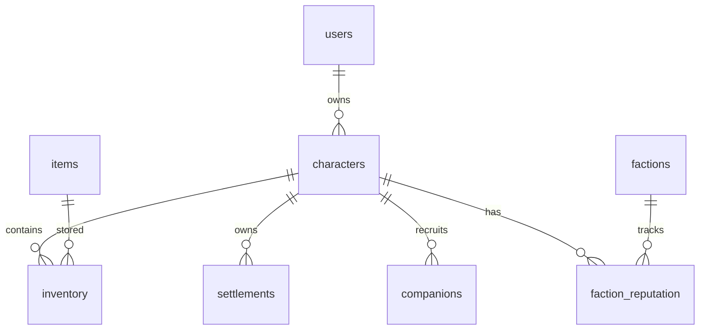
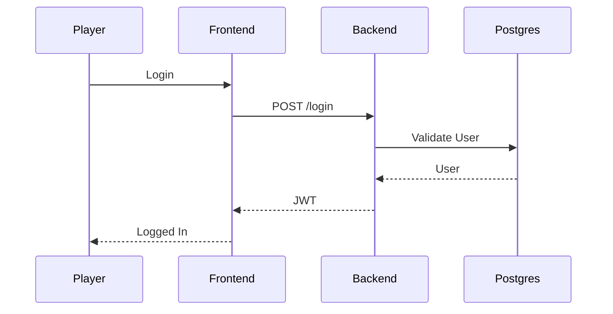
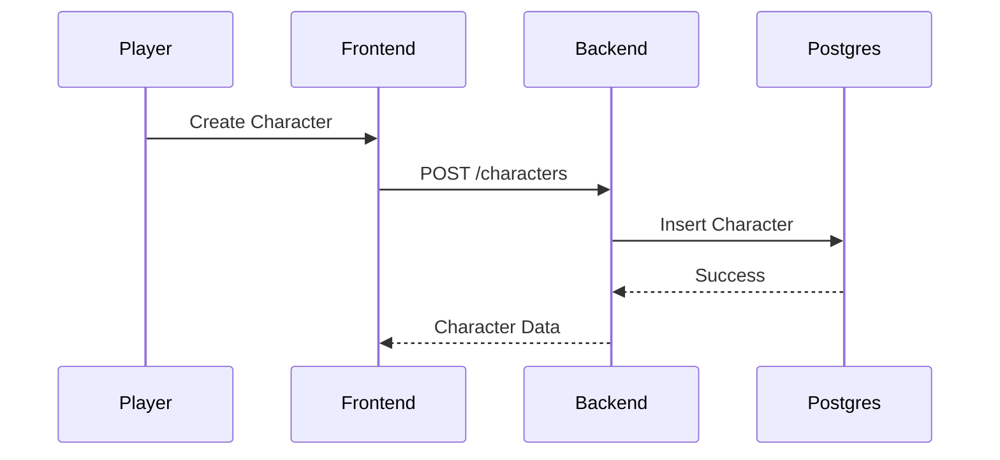
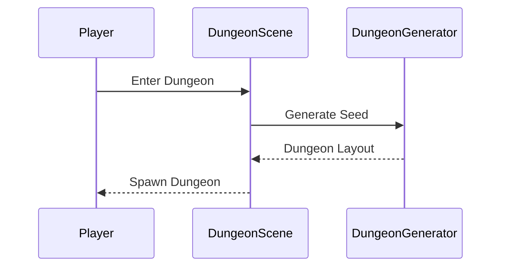
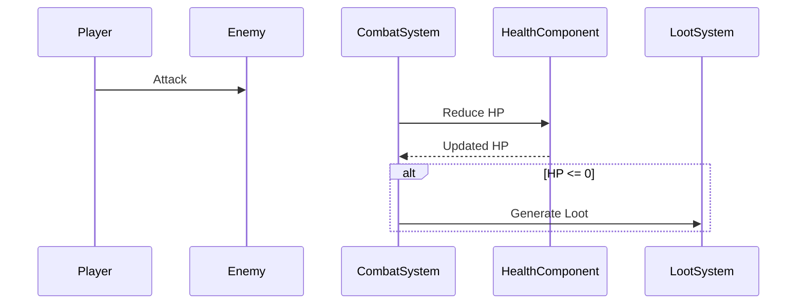
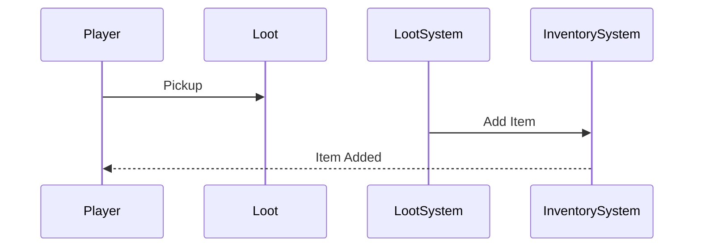
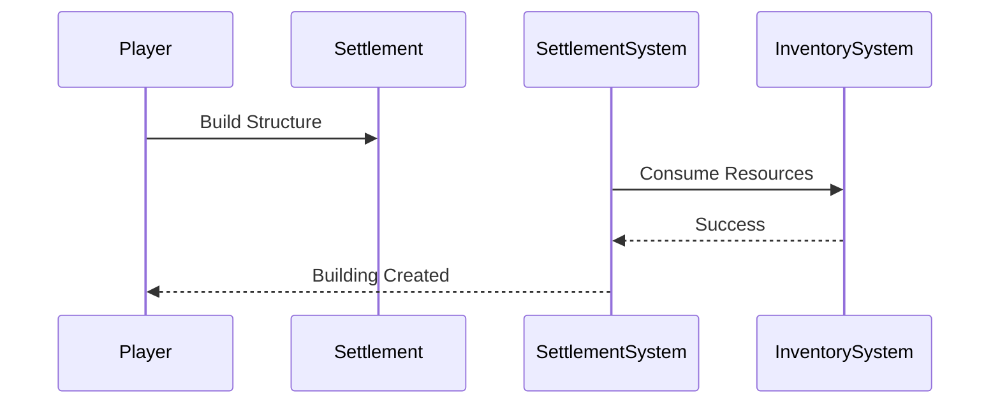

# Kingdoms of Ruin

## Technical Design Document (TDD) v1.0

---

# 1. Purpose

Dokumen ini menjelaskan arsitektur teknis Kingdoms of Ruin.

Tujuan utama:

* Maintainability jangka panjang
* Skalabilitas fitur
* AI-Agent Friendly Development
* Multiplayer-ready Architecture
* ECS-first Design

---

# 2. High-Level Architecture

```text
Frontend (Phaser.js)
        │
        ▼
State Management (Zustand)
        │
        ▼
API Layer
        │
        ▼
Fiber Backend
        │
 ┌──────┴──────┐
 ▼             ▼
PostgreSQL   WebSocket
```

---

# 3. Project Structure

## Repository

```text
kingdoms-of-ruin/

├── frontend/
├── backend/
├── docs/
├── assets/
├── tools/
├── scripts/
└── .github/
```

---

# 4. Frontend Structure

```text
frontend/src/

├── assets/
├── scenes/
├── entities/
├── components/
├── systems/
├── stores/
├── services/
├── ui/
├── types/
├── utils/
└── config/
```

---

## Scenes

```text
BootScene
MenuScene
CharacterSelectScene
WorldScene
DungeonScene
SettlementScene
UIScene
```

---

# 5. ECS Architecture

Kingdoms of Ruin menggunakan ECS (Entity Component System).

---

## Entity

Entity hanya ID.

Contoh:

```text
Player
Monster
NPC
Companion
Projectile
Item
Building
ResourceNode
```

---

## Components

### PositionComponent

```ts
{
  x: number
  y: number
}
```

---

### VelocityComponent

```ts
{
  speed: number
}
```

---

### HealthComponent

```ts
{
  current: number
  max: number
}
```

---

### ManaComponent

```ts
{
  current: number
  max: number
}
```

---

### CombatStatsComponent

```ts
{
  attack: number
  defense: number
  critChance: number
}
```

---

### InventoryComponent

```ts
{
  slots: Item[]
}
```

---

### AIComponent

```ts
{
  state: string
}
```

---

### QuestComponent

```ts
{
  activeQuests: Quest[]
}
```

---

### FactionComponent

```ts
{
  factionId: number
  reputation: number
}
```

---

# 6. Systems

## MovementSystem

Responsibilities:

* Movement
* Collision checks

---

## CombatSystem

Responsibilities:

* Damage
* Critical hits
* Death handling

---

## AISystem

Responsibilities:

* Enemy behavior
* NPC decisions

---

## LootSystem

Responsibilities:

* Drop generation
* Loot spawning

---

## InventorySystem

Responsibilities:

* Item storage
* Equipment management

---

## QuestSystem

Responsibilities:

* Progress tracking
* Reward handling

---

## EconomySystem

Responsibilities:

* Dynamic pricing
* Supply-demand calculations

---

## FactionSystem

Responsibilities:

* Reputation updates
* Diplomacy calculations

---

## CompanionSystem

Responsibilities:

* Companion behavior
* Loyalty tracking

---

# 7. State Management

Zustand Stores

```text
authStore
playerStore
inventoryStore
worldStore
questStore
economyStore
factionStore
uiStore
```

Rule:

Game state tidak disimpan langsung di Scene.

Scene hanya membaca state.

---

# 8. Backend Architecture

```text
backend/

├── cmd/
├── internal/
│
├── auth/
├── users/
├── characters/
├── inventory/
├── items/
├── world/
├── settlements/
├── quests/
├── factions/
├── websocket/
│
└── pkg/
```

---

# 9. Backend Layers

## Handler

Responsibilities:

* HTTP parsing
* Validation

---

## Service

Responsibilities:

* Business logic

---

## Repository

Responsibilities:

* Database access

---

# 10. Database Architecture

Database:

```text
PostgreSQL
```

---

## users

```sql
id
email
password_hash
created_at
```

---

## characters

```sql
id
user_id
name
level
experience
created_at
```

---

## items

```sql
id
name
rarity
type
value
```

---

## inventory

```sql
id
character_id
item_id
quantity
```

---

## settlements

```sql
id
owner_id
name
population
```

---

## companions

```sql
id
owner_id
name
loyalty
```

---

## factions

```sql
id
name
description
```

---

## faction_reputation

```sql
character_id
faction_id
reputation
```

---

## quests

```sql
id
title
description
reward
```

---

# 11. ERD



---

# 12. Authentication Flow



---

# 13. Character Creation Flow



---

# 14. Dungeon Generation Flow



---

# 15. Combat Flow



---

# 16. Loot Collection Flow



---

# 17. Settlement Construction Flow



---

# 18. Save System

Phase 1:

```text
Character
Inventory
Progress
```

saved to PostgreSQL.

---

Future:

```text
World State
Settlement State
NPC State
Faction State
```

persisted separately.

---

# 19. Multiplayer Migration Strategy

Current:

```text
Single Player
```

Future:

```text
Fiber
↓
WebSocket Gateway
↓
Game Server
↓
PostgreSQL
```

---

# 20. Redis Integration Strategy

Not included in MVP.

Future Uses:

* Session Cache
* Presence
* Matchmaking
* Leaderboards
* Event Bus

---

# 21. Event System

Future architecture:

```text
PlayerAction
↓
Event Queue
↓
World Event Processor
↓
Database
```

Examples:

```text
QuestCompleted
BuildingConstructed
FactionWarStarted
BossDefeated
```

---

# 22. Performance Targets

Phase 1

* 60 FPS
* 200 active entities

Phase 5

* 2,000 active entities

Phase 10

* Multiplayer support
* 100+ concurrent players

---

# 23. Technical Principles

1. ECS First
2. Data-Oriented Design
3. Modular Systems
4. Event-Driven Communication
5. Database Isolation
6. Multiplayer-Ready Architecture
7. AI-Agent Friendly Structure

---

# 24. Non-Goals (MVP)

Not included initially:

* Multiplayer
* Guilds
* Dedicated Servers
* Voice Chat
* PvP Rankings
* Global Market

These features are deferred until after the core single-player experience is stable.
